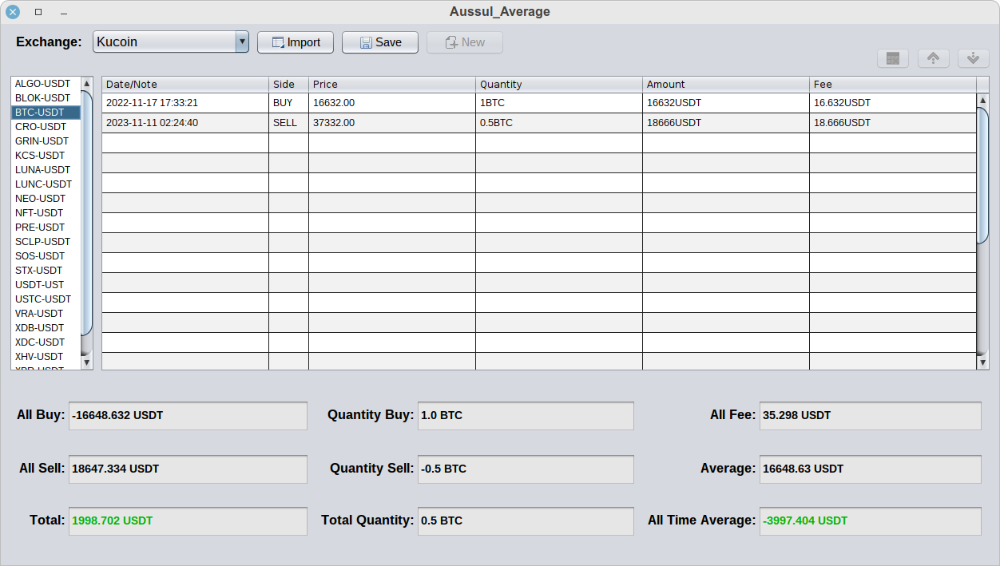

# Aussul_Average

----
## About

Java Program for Calculate  Average , Total Amount buy / sell , Quantity , Fees
* using for:
 - All Crypto Currency pairs (Example: BTC - USDT , XRP - TUSD , LTC - USDC..).
 - Forex (Example: EUR - USD..).
 - Gold (Example: GOLD - USD..).
* and you can use this program for:
 - Stocks (Example: TSLA - USD..).

----
## Requirements:

Any system with Java support (Java Runtime Environment [JRE](https://www.java.com/)) 8 or higher.

----
## Usage

* add orders: 
you can add orders to this program in tow way:
		- Manual.
		- Import csv: support (Binance , Kucoin) only, (you can add support other exchange not supported see FAQ).
	
shortcut:
		if you enter "d" in (Date/Note)  print current date and time.
		if you enter "b" in (Side) print BUY , "s" print SELL.		
		Note: first row need complite information (value + currency) and other rows you can enter numbers only , 
		the program copy currency from first row , if curruncy different from first row you need enter it.
		
in Table:
		TAB = next cell.
		Space = next focus (out from Table to Buttons).
		

* Exchange: 
you can add new exchange you should enter:
				-Name.
				-Default Fee currency: 
					what default fee currency use this exchange (Binance use BNB default , Kucoin use USDT default ) check in orders for know.
				-Default Fee Percentage:
					what default fee percentage for your account choose max from maker - taker(Binance use 0.0750% , Kucoin use 0.1%)
					you can use custom fee percentage for every pair (right click on pair) , if no custom fee percentage the program use default.
					program use this value in one case:
							if we have 3 different curruncy in order example (BTC-USDT and fee in BNB).
					example for case program not use this value , 2 curruncy (BTC-USDT and fee in USDT) or (BTC-USDT and fee in BTC).		
	
you can delete exchange you should enter:	
				-Name of exchange.	

* Import:
you can import csv file (.csv) to this program from supported exchanges  just make sure you choose right exchange.
	Note: after first import make sure not import same csv file or same orders again , this will add orders 2 times.

----
## FAQ

### How do I add support to my exchange ?

This is 2 exchange not supported to understand how (this steps for every import) :

1. Gateio
2. CoinEX

* step1 : File extension should be .csv (if your file format .csv go to step 2):

	* Gateio:
	1. this file end with .abw to format it open this file with (LibreOffice Writer) or (Office Word) 
	2. go to File > Preview in Web Browser.
	3. from Web Browser copy all lines and create new file with .csv , open it in notepad..  paste data & save .

	
	* CoinEX:
	1. this file end with .xlsx to format it open this file with (LibreOffice Calc) or (Office Exel) 
	2. go to File > Save As.
	3. choose .csv and save.	

* step2 : open .csv file in notepad 
	
This is accipted words in program:
`
	* "Date": date or time for order.
	* "Pair": pair name     ex(BTC-USDT).
	* "Side": side order    ex(SELL or BUY).
	* "Price": price order  ex(BTC price 34000.00)
	* "Quantity": quantity ex(you sell 0.5BTC quantity= 0.5BTC ).
	* "Amount": Amount order ex(you sell 0.5BTC in price 34000.00USDT , Amount = 17000.00USDT).
	* "Fee": fee order ex(17000.00USDT * 0.1% ,Fee = 17USDT ) .
	* "Fee Currency": use this if fee value in data not (value + currency) ex(Fee= 17 , Fee Currency= USDT ).
`
	
Now we need edit first line (replace words):
		
		Gateio:
			original first line (header): 
				` No,Order id,Time,Trade type,Maker/Taker,Pair,Price,Amount,Fee,Total `

				after replace words :
					` No,Order id,Date,Side,Maker/Taker,Pair,Price,Quantity,Fee,Amount `

				Fee value (value + currency) we not need "Fee Currency".
			
		------------------------------------------------
		CoinEX:
			original first line (header):
				` Execution Time,Trading pair/Contract name,Side,Executed Price,Executed Amount,Executed Value,Fees,Fees Coin Type,Executed Type `
			
			after replace words :	
				` Date,Pair,Side,Price,Quantity,Amount,Fee,Fee Currency,Executed Type `

			Fee value not (value + currency) we need use "Fee Currency".
			
		------------------------------------------------	
		Note: every line Pair data should be in currncy-currncy ex(BTC-USDT) if Quantity data and Amount data not in format (value+currency).
		Gateio pair data "BTC/USDT" but Quantity data and Amount data (value + currency) , we not need change pair data.
		CoinEX pair data "BTCUSDT" and Quantity data and Amount data not (value+currency) , every line we need add "-" to pair data "BTC-USDT"
		you can replace all (BTCUSDT) to (BTC-USDT)	, and do this to every single pair in data.
		
		save file.

* step3 : add new exchange in program:
`
					     Name        Default Fee currency                    Default Fee Percentage
					   Gateio    >              GT                       >          0.15 (VIP 0 check in your account)
					   CoinEX  >             CET                      >          0.16 (VIP 0 check in your account)
`
		finally import CSV file from program.

### I am Buy service.. (for example in 0.1BTC) , how I can add this order to program to see my real All Time Average?
	simply add new order with same date ,Side SELL , Price enter "-" , enter Quantity 0.1 , enter Amount (if pair is BTC-USDT enter the cost in USDT) ,Fee enter "-".

### All Time Average down to less than 0 why?
	This mean all your money is out (from 0) and the quantity never go to lose this is best trade.

Donations
---------------

You are welcome to donate in BTC (Bitcoin Network)

Address: bc1qs083f0tgpsdtgeltgwz8t7auajjz0yjh89dftx

Thank you for support.

Downloads
----------------
Download `Aussul_Average.jar` from the [latest release](https://github.com/aussul/Aussul_Average/releases).

License
-----------
Licensed under [GPLv3](http://www.gnu.org/licenses/), see code for more information

