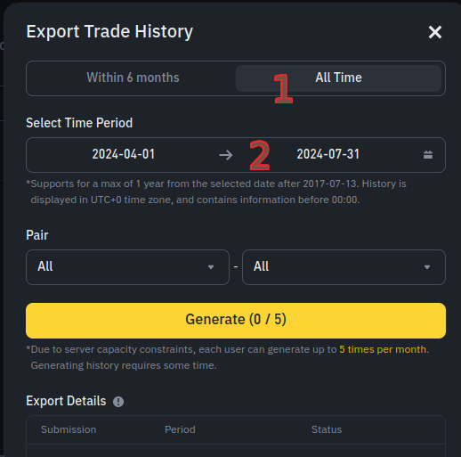
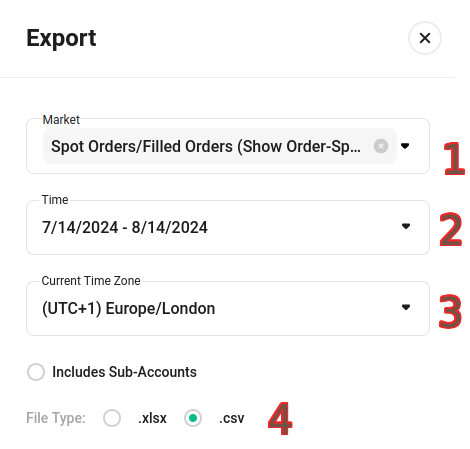

# Aussul_Average


## About

Java Program to Calculate  Average , Total Amount Buy / Sell , Quantity , Fees
using for:
 - All Crypto Currency pairs (Example: BTC - USDT , XRP - TUSD , LTC - USDC..).
 - Forex (Example: EUR - USD..).
 - Stock (Example: TSLA - USD..).


## Requirements:

Any system with Java support (Java Runtime Environment [JRE](https://www.java.com/)) 8 or higher.


## Usage


* add orders:

	you can add orders to this program in tthis way:

    * Manual.
    * Import csv file support (Binance , Kucoin) only, (you can add support other exchange not supported see FAQ).
	
* shortcuts in Table:

   * if you enter "d" in (Date/Note)  print current date and time.
   * if you enter "b" in (Side) print BUY , "s" print SELL.
   * TAB button = next cell.
   * Space button = next focus (out from Table to Buttons).
   * you can use currency symbol ($,€,¥,£..) but use same currency symbol every where (the program see $ currency and USD another currency).

     Note: in first row enter full information (value + currency) and other rows you can enter numbers only , 
     the program copy currency from first row , if curruncy different from first row you need enter it.


* Exchange: 

	To add new exchange you should enter:

   * Name of exchange.
   * Default Fee currency: 		
      The default fee currency use this exchange
     (Binance use BNB default , Kucoin use USDT default ) check in orders for know.
 
  * Default Fee Percentage:
     The  default fee percentage for your account
     choose max from maker - taker (Binance use 0.0750% , Kucoin use 0.1%)
     
	 Note: you can use custom fee percentage for every pair (right click on the pair name in pair list) ,
     if no custom fee percentage the program use default.

     program use this value in one case:
    	if we have 3 different curruncy in order example (BTC-USDT and fee in BNB).

      example for case program not use this value:
        2 curruncy only (BTC-USDT and fee in USDT) or (BTC-USDT and fee in BTC).		
	
   To delete exchange you should enter:	

  * Name of exchange.	


* Import:

   you can import csv file (.csv) to this program from supported exchanges just make sure you choose right exchange.

  Note: after first import make sure not import same csv file or same orders again , this will add orders 2 times.
  
* Export csv from Binance:
  
  
  
* Export csv from Kucoin:
  
  


## FAQ


### How do I add support to my exchange ?

This is 2 exchange not supported to understand how (this steps for every import) :

1. Gateio
2. CoinEX

* step1 : File extension should be .csv (if your file format .csv go to step 2):

	* Gateio:

  		1. File extension .abw to format it open this file with (LibreOffice Writer) or (Office Word) 
		2. go to File > Preview in Web Browser.
		3. from Web Browser copy all lines and create new file with .csv , open it in notepad..  paste data & save .

	
	* CoinEX:

  		1. File extension .xlsx to format it open this file with (LibreOffice Calc) or (Office Exel) 
		2. go to File > Save As.
		3. choose .csv and save.	


 ------------------------------------------------
* step2 : open .csv file in notepad 
	
This is accepted words in program for header:

```
* "Date": date or time for order. 
* "Pair": pair name     ex(BTC-USDT) if Quantity and Amount not in format (value+currency) in this case format should be (currncy-currncy).
* "Side": side order    ex(SELL or BUY).
* "Price": price order  ex(BTC price 34000.00)
* "Quantity": quantity ex(you sell 0.5BTC quantity= 0.5BTC ).
* "Amount": Amount order ex(you sell 0.5BTC in price 34000.00USDT , Amount = 17000.00USDT).
* "Fee": fee order ex(17000.00USDT * 0.1% ,Fee = 17USDT ) .
* "Fee Currency": use this if fee value in data not in format (value + currency) ex(Fee= 17 , Fee Currency= USDT ).
```
	
Now we need replace words in the header (first line) :		

  * Gateio:		

     * original first line (header):   
	`No,Order id,Time,Trade type,Maker/Taker,Pair,Price,Amount,Fee,Total`

     * after replace words :  
	`No,Order id,Date,Side,Maker/Taker,Pair,Price,Quantity,Fee,Amount`


	 Fee value in format (value + currency) we not need "Fee Currency".
			
    ------------------------------------------------

  * CoinEX:

     * original first line (header) :  
	`Execution Time,Trading pair/Contract name,Side,Executed Price,Executed Amount,Executed Value,Fees,Fees Coin Type,Executed Type`
			
     * after replace words :  
	`Date,Pair,Side,Price,Quantity,Amount,Fee,Fee Currency,Executed Type`


	Fee value not in format (value + currency) we need use "Fee Currency".
			

	Note: every line Pair data should be in currncy-currncy ex(BTC-USDT) if Quantity data and Amount data not in format (value+currency).
	
 	  * Gateio pair data "BTC/USDT" but Quantity data and Amount data (value + currency) , we not need change pair data.
	
 	  * CoinEX pair data "BTCUSDT" and Quantity data and Amount data not (value+currency) , every line we need add "-" to pair data "BTC-USDT"
	     you can replace all (BTCUSDT) to (BTC-USDT) , and do this to every single pair in data.
	
	Save file.

    ------------------------------------------------
    
* step3 : add new exchange in program:

```
Name           Default Fee currency                       Default Fee Percentage
Gateio                    GT                                 0.15 (VIP 0 check in your account)
CoinEX                  CET                               0.16 (VIP 0 check in your account)
```
	
   Finally import CSV file from program.


------------------------------------------------


### I am Buy anything in BTC , how I can add this order to program to see my real All Time Average?
  simply add new order in buttom (for example cost is 0.5BTC and btc price is 34000USDT):
 
  `Date="d" , Side="SELL" , Price="-" , Quantity="0.5BTC" , Amount=17000USDT , Fee="-" `
  
  Note: if there fee add it with Amount.

------------------------------------------------

### i am close my bot how add order to program?
  if you close your bot in lost:   
  `Date="d" , Side="Buy" , Price="-" , Quantity="0 if just usdt return from bot" , Amount , Fee="-" `
  
  if you close your bot in win:    
  `Date="d" , Side="Sell" , Price="-" , Quantity="0 if just usdt return from bot" , Amount , Fee="-" `

Note: Amount the different between in and out cost to the bot Example: 
		in winner bot with cost 100USDT , after close it you have 120USDT then Amount = 20USDT.
		in loser bot with cost 100USDT , after close it you have 20USDT then Amount = 80USDT.

------------------------------------------------

### All Time Average down to less than 0 why?
  This mean all your money is completely out (from 0) and your quantity never go to lose , this is best trade.

------------------------------------------------

### Where the program data saved in my system?
  In your home folder (user main folder) the folder name is Aussul_Average.

------------------------------------------------

Downloads
----------------
Download `Aussul_Average.jar` from the [latest release](https://github.com/aussul/Aussul_Average/releases).


Donations
---------------
You are welcome to donate and support the project this is my addresses:

BTC (Network: Bitcoin)
`bc1q79unudgulatz2jqp03jrrlztsgwy9pkdwdxral`

LTC (Network: Litecoin)
`ltc1qyz562l0xsw9d0hvy9ls2nefjff96r8vexnkdgs`

XRP (Network: Ripple)
`rfBiGmf1WppVT9y4X9cWwpXuxL4WD5Ment`

XMR (Network: Monero)
`8BuBYuj9uHdgKiyL5x3uQt6K3X32pSEdHfnpDxXSrRb2ZaTbiZtUeGCB4dY5sUWaA41AvacFvBdfLhLcZVzet8EDK46kfwn`

XHV (Network: Havenprotocol)
`hvxyKUkQCh3AtxJfhheGU7Fgzm6QAuvYyHJJ4N8m8iUw3Ugoxa5n4JCdHtaxMVaXzyNUcoPnHrkwk1vtXGB6oVEj4xKX8J31CJ`

XLM (Network: Stellar)
`GC7SRI3SFTDUBD5OPLPIOWQNPIUBKLQDMHCWIQVGOGGQERPC7R2BBKUF`

ETH (Network: Ethereum ERC20)
`0x608E0EBc68A605DcD3E9F5074Dd8b60370Df8692`

BCH (Network: Bitcoin Cash)
`qqsr9gft5t6dt6lt92j05mhkskvv65wqls8u05js5k`

TRX  (Network: TRX(Tron) TRC20)
`TTRwq9yi9DbD4d8DqX6Jd941d5C8aCziet`

ALGO (Network: Algorand)
`N5WYNW5ORELRADOR5B2OGKMCNGBLRLGXM6JPBH5LQKDRRI23Y2HWCVGP3U`

BNB (Network: BSC(BNB Smart Chain) BEP20)
`0x9f81679fca574219C2A87A27980Ec8C70CA7067A`

DOGE (Network: Dogecoin)
`DKyEtLNRynA35QwVWp15nCMoDszZVLajbS`

USDT  (Network: TRX(Tron) TRC20)
`TTRwq9yi9DbD4d8DqX6Jd941d5C8aCziet`

USDT (Network: BSC(BNB Smart Chain) BEP20)
`0x608E0EBc68A605DcD3E9F5074Dd8b60370Df8692`


Thank you for support.

Build & Run
---------------
just import the project to NetBeans and Build it

some systems you need make `Aussul_Average.jar` executable by right click and change file permissions to executable.


License
-----------
Licensed under [GPLv3](http://www.gnu.org/licenses/).

